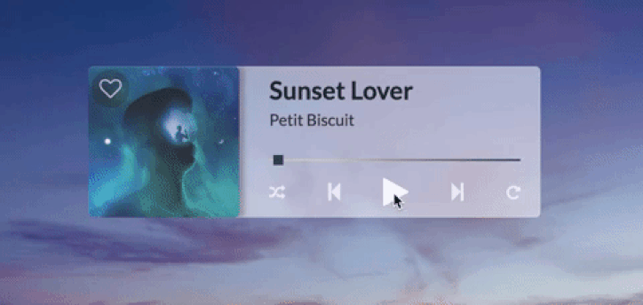

# Selenite (beta) - A Minimalistic Spotify Player for MacOS
 

  

Selenite is a simpler, more minimalistic alternative to navigate your Spotify playback. It supports song as well as podcast playback (including repeat and shuffle) and allows you to save or remove the currently playing song from your library.

This version is still in beta. Future iterations will include browsing and managing your playlists, artist and album/podcast navigation, as well as UI updates (three different themes, UX improvements).

A Windows version is also planned.  
 
## Installation
(Instructions will follow)