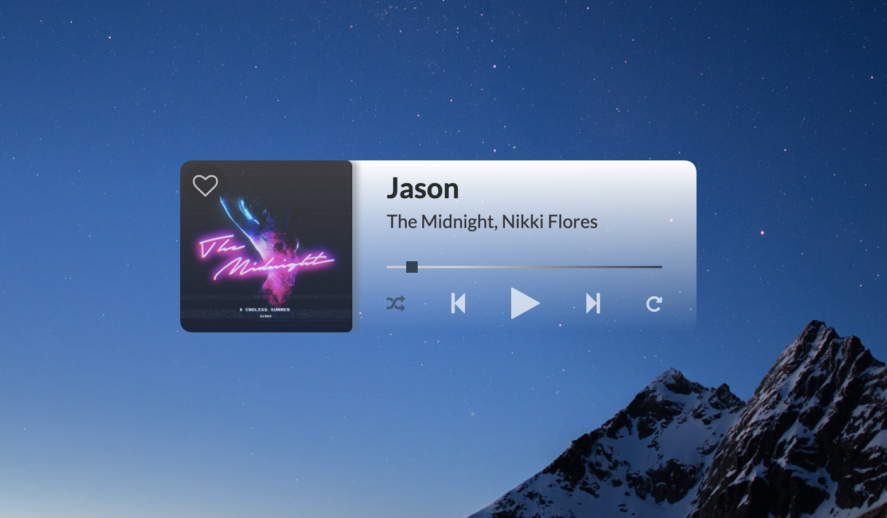

<p align="center">
  <h1 align="center">Selenite</h1>

  <p align="center">
     <strong>A clean and minimalistic desktop player for Spotify</strong>
    <br>
  </p>
  <a href="https://github.com/Selenite-Player/Selenite">
    
  </a> 
</p>


## Table of contents
- [About the App](#about-the-app)
- [Technical](#technical)
- [Contributing](#contributing)
- [Licence](#license)

## About the App

Selenite is a simpler, more minimalistic alternative to navigate your Spotify playback. It supports song as well as podcast playback and allows you to save or remove songs from your "liked songs" library.

### How it works

To make this app available to everyone, Selenite uses [Spotify's free Web API](https://developer.spotify.com/documentation/web-api/). This means the app runs alongside Spotify (whether you have Spotify running in your browser or any of the official apps). It won't replace the actual application you are listening with, but adds an extra interface to navigate the Spotify playback of whichever device or app you are using.

### Installation

1. Clone the [repository](https://github.com/Selenite-Player/Selenite).
2. Install all dependencies via ```npm install```.
3. Go through the [Setup](#setup) steps detailed in the next paragraph.
4. Start the app with ```npm start```.

### Setup

To use this app, you will need to get a ```Client Id``` from Spotify and [add the app to your developer account](https://developer.spotify.com/documentation/general/guides/authorization/app-settings/):

1. Go to the [Spotify Developer Dashboard](https://developer.spotify.com/dashboard/).
2. Click on _Create an App_ and enter a name and description of your choice.
3. Once the app is registered, you will be redirected to the app overview page. Here you will find your ```Client Id```. Copy the id and add it to Selenite's config file.
4. Next, you will have to add a _redirect URI_. Per default, Selenite is set to use port 8888, so the URI will be ```http://localhost:8888/callback```. If you want to run the app on a different port, you can change the port in the Selenite config file and adjust the callback URI accordingly. Back at the app overview page, click on _Edit Settings_ and enter the URI under _Redirect URIs_. Save, and you are all set to go!

### Usage

Upon first launch, Selenite will open a Spotify login page and ask for permission to view your account data (for login and authentication), your activity on Spotify (to retrieve playback information), and to take actions in Spotify on your behalf (to add or remove liked songs). Selenite itself doesn't access any of your account data, it is only needed during the sign-in and authentication process.

Once you are succsfully logged in, you will be redirected to the app. Open Spotify on a device of your choosing and start playing your music or podcasts. Selenite will pick up which device you are listening on and connect to it. Now you can minimize or let Spotify run in the background and navigate your playback via Selenite.

You can play, pause, and skip tracks, as well as enable or disable shuffle and repeat. You can also jump into the middle of a track using the progress bar. If you want to save or remove a song from your library, simply click the heart icon on the cover image.

## Technical

### Technologies Used

 
 
 


### To Do List

You can find a roadmap for this project [here](https://github.com/orgs/Selenite-Player/projects/1).

### Contributing

- Found a **bug** or have a concrete **feature request**? Open a corresponding issue via the [Issues Tab](https://github.com/Selenite-Player/Selenite/issues).

- For any other **feedback**, **questions**, or **ideas**, please use the [Discussions Tab](https://github.com/Selenite-Player/Selenite/discussions) to reach out.


## License

* see [LICENSE](https://github.com/YourUserNameHere/ProjectName/LICENSE.md) file
